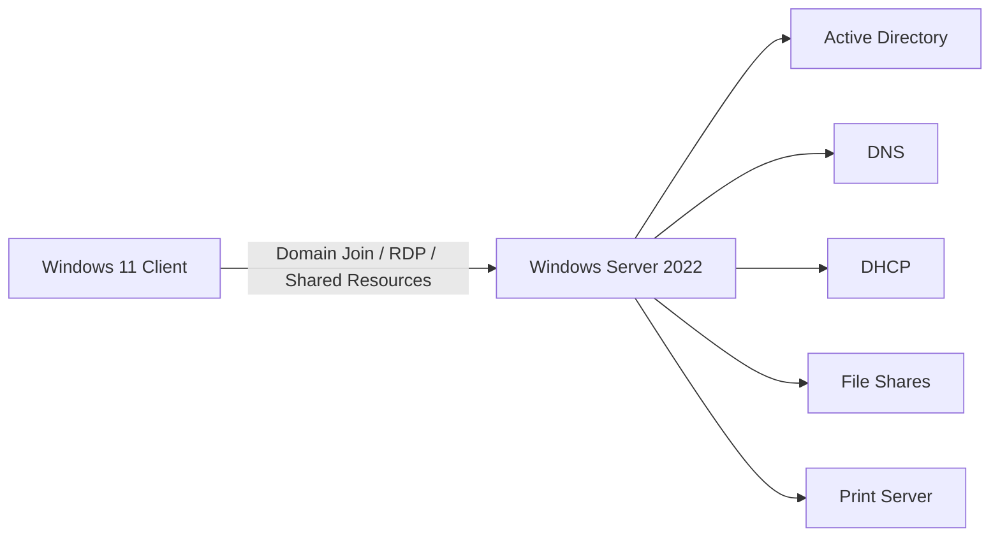

# 🧪 IT Home Lab Portfolio

> A collection of hands-on labs I built while learning system administration, help desk support, and Windows Server fundamentals.

I built this lab to move past theory and actually practice how systems work together in a real environment: users, servers, permissions, DNS, DHCP, shared resources, and troubleshooting.

---

## 🖥️ Lab Design

---

##  What This Lab Covers

| Area | What I Practiced |
|---|---|
| Active Directory | Domain setup, users, groups, authentication |
| DNS | Domain name resolution and troubleshooting |
| DHCP | Scope setup, IP assignment, authorization issue |
| File Sharing | Shared folders, NTFS permissions, access control |
| Printers | Network printer simulation and user access |
| Remote Desktop | Remote access and session troubleshooting |

---

## 📁 Projects

### 🖥️ Active Directory Lab
`active-directory` `windows-server` `dns`

Set up a domain controller and joined a Windows 11 client.  
Worked through DNS issues and domain login failures.

👉 [https://github.com/YOUR-USERNAME/ad-home-lab](https://github.com/zainab5612/active-directory-windows11-networking)

---

### 📁 File Sharing & Permissions
`file-sharing` `ntfs` `security-groups`

Configured shared folders and tested access control using users and groups.

👉 [https://github.com/YOUR-USERNAME/file-sharing](https://github.com/zainab5612/windows-server-file-sharing-access-control)

---

### 🌐 DHCP Lab
`dhcp` `networking` `troubleshooting`

Configured DHCP and fixed issue where clients received 169.254 IP (not authorized).

👉 https://github.com/YOUR-USERNAME/dhcp-lab

---

### 🖨️ Printer Lab
`print-server` `network-printer` `permissions`

Set up and shared a printer.  
Troubleshot authentication issues between users.

👉 [https://github.com/YOUR-USERNAME/printer-lab](https://github.com/zainab5612/printer-setup-and-permissions)

---

### ⚙️ Patch Management & Automation (Action1)
`patch-management` `automation` `endpoint-management` `security`

Used Action1 to deploy updates, manage vulnerabilities, and generate audit reports.  
Worked with scheduled patching, system reboots, and compliance reporting (SOC 2, ISO 27001, HIPAA).

👉 https://github.com/zainab5612/patch-management-action1-auditing

---

## 🔍 Troubleshooting I Worked Through

- DNS pointing to the wrong server
- Domain login failures
- DHCP not assigning IP addresses
- DHCP server not authorized
- Permission conflicts between users
- Printer authentication errors
- NAT vs internal network confusion

---

##  Skills I’m Building

- Windows Server Administration
- Active Directory
- DNS and DHCP
- Network troubleshooting
- User and group management
- File sharing and permissions
- Remote Desktop support
- Help desk style problem solving

---

##  Notes

Each project includes notes where I documented:

- what confused me
- what I tested
- what broke
- what fixed the issue

---

##  Why I Built This

This lab helped me understand how different parts of an IT environment depend on each other.

The biggest thing I learned is that troubleshooting is not about guessing. It is about checking each layer: network, DNS, authentication, permissions, and services.
